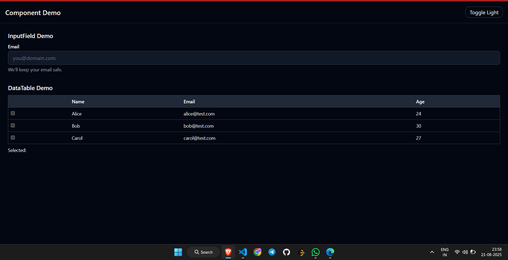

# React Component Development Assignment

This repository contains two reusable React components built with **React**, **TypeScript**, **TailwindCSS**, and **Storybook**.

- 🎯 **Component 1:** InputField
- 📊 **Component 2:** DataTable

Both components follow **scalable structure, accessibility practices, responsive design, and include Storybook stories & unit tests**.

---

## 🚀 Tech Stack

- [React 18](https://react.dev/) + [TypeScript](https://www.typescriptlang.org/)
- [TailwindCSS](https://tailwindcss.com/) for styling
- [Storybook 8](https://storybook.js.org/) for documentation
- [Vitest](https://vitest.dev/) + [Testing Library](https://testing-library.com/) for testing

---

## 📂 Project Structure

```
src/
components/
InputField/
InputField.tsx
InputField.stories.tsx
InputField.test.tsx
index.ts
DataTable/
DataTable.tsx
DataTable.stories.tsx
DataTable.test.tsx
index.ts
index.ts # re-exports
lib/
cn.ts # utility for className merging
App.tsx # example usage
main.tsx
index.css
```

---

## 🖥️ Setup Instructions

Clone repo and install dependencies:

```bash
git clone https://github.com/<your-username>/<repo-name>.git
cd <repo-name>
pnpm install # or npm install / yarn install

```

Run Locally:

```bash
pnpm dev

```

Build Production

```bash
pnpm build
```

---

## 📘 Storybook

Run Storybook locally:

```bash
pnpm storybook

```

Build static Storybook for deployment:

```bash
pnpm build-storybook

```

---

## 🧩 Components

### 1. InputField

**Features:**

- Label, placeholder, helper text, error message
- States: disabled, invalid, loading
- Variants: filled, outlined, ghost
- Sizes: sm, md, lg
- Optional: clear button, password toggle
- Dark/light theme support

props:

```ts
interface InputFieldProps {
  value?: string;
  onChange?: (e: React.ChangeEvent<HTMLInputElement>) => void;
  label?: string;
  placeholder?: string;
  helperText?: string;
  errorMessage?: string;
  disabled?: boolean;
  invalid?: boolean;
  variant?: "filled" | "outlined" | "ghost";
  size?: "sm" | "md" | "lg";
  type?: string;
  clearable?: boolean;
  showPasswordToggle?: boolean;
  loading?: boolean;
}
```

---

### 2. DataTable

**Features:**

- Display tabular data
- Column sorting (asc/desc)
- Row selection (single/multiple)
- Loading & empty states
- Responsive + accessible

props:

```ts
interface DataTableProps<T> {
  data: T[];
  columns: Column<T>[];
  loading?: boolean;
  selectable?: boolean;
  onRowSelect?: (selectedRows: T[]) => void;
}
interface Column<T> {
  key: string;
  title: string;
  dataIndex: keyof T;
  sortable?: boolean;
}
```

---

## 📤 Submission Checklist

- Two working components (InputField, DataTable)

- Example usage in App.tsx

- Storybook documentation with interactive states

- Unit tests for both components

- README with setup instructions & approach

---

## 📸 Preview



---

## 👤 Author

Bhumika Salunkhe – [GitHub](https://github.com/Bhumika2101) | [LinkedIn](https://www.linkedin.com/in/bhumika-salunkhe-02263725b)
